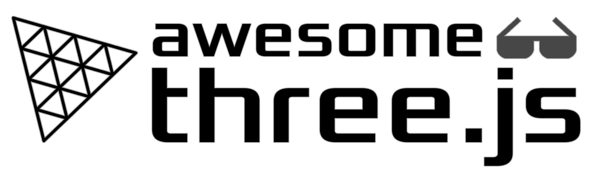

     
    
    <h1>Awesome Threejs</h1>
    

		<b>3️⃣ A curated list of awesome ThreeJS resources</b>
	

# Contents

- [Core](#Core)
- [Books](#Books)
- [Courses](#Courses)
- [Articles](#Articles)
- [Inspiration](#Inspiration)
- [Resources](#Resources)
- [Tools](#Tools)
- [Libraries](#Libraries)
- [Community](#Community)

- [How to contribute to this repository?](#Contribute)

# Core

- [ThreeJS official website](https://threejs.org/)
- [ThreeJS examples](https://threejs.org/examples/#webgl_animation_keyframes)
- [ThreeJS documentation](https://threejs.org/docs/index.html#manual/en/introduction/Creating-a-scene)

# Books

## 3D Theory

- [3D Math Primer for Graphics and Game Development](https://gamemath.com/book/intro.html): A must-read book to be
  comfortable with 3D maths.

## ThreeJS

- [Discover three.js](https://discoverthreejs.com/)
- [Learn Three.js - Third Edition](https://www.packtpub.com/product/learn-three-js-third-edition/9781788833288)

# Courses

## ThreeJS

- [ThreeJS Journey](https://threejs-journey.com/): A great course accessible for the most beginner programmer who
  wants to learn how to make ThreeJS 3D experiences from scratch.

## Shaders

- [The Easiest Way to Learn GLSL](https://simondev.teachable.com/p/glsl-shaders-from-scratch)
- [The Book of Shaders](https://thebookofshaders.com/): A reference on the road to master shaders. And it's free.

# Articles

## Documentation

- [ThreeJS Fundamentals](https://threejs.org/manual/#en/fundamentals)
- [Shaderific for OpenGL](https://shaderific.com/index.html): Documentation on GLSL
- [GLSL documentation](https://docs.gl/sl4/clamp)

## 3D Theory

- [Explaining Homogeneous Coordinates & Projective Geometry](https://www.tomdalling.com/blog/modern-opengl/explaining-homogenous-coordinates-and-projective-geometry/): A very comprehensive article on homogeneous coordinates and projective geometry (To finally understand what is the 4th coordinate (w) in your vertex shaders)

## Tutorials

- [Surface Sampling in Three.js](https://tympanus.net/codrops/2021/08/31/surface-sampling-in-three-js/): A comprehensive
  article about MeshSurfaceSampler
- [How to Create a Fake 3D Image Effect with WebGL](https://tympanus.net/codrops/2019/02/20/how-to-create-a-fake-3d-image-effect-with-webgl/):
  A good article to learn how to add a fake depth to a 2D image in ThreeJS.
- [Tutorial on Matrices](http://www.opengl-tutorial.org/fr/beginners-tutorials/tutorial-3-matrices/): A limpid tutorial
  to understand shader projection, view and model matrices (visually impactful)

# Inspiration

## Common

- [same.energy](https://same.energy/): Visual search engine by keyword or picture (a bit like Pinterest)
- [Pinterest](https://www.pinterest.fr/): Good source of inspiration

## Shaders

- [ShaderToy](https://www.shadertoy.com/): Prepare to be blown away by this shader sharing platform.

# Resources

## Matcaps

- [Matcap repository](https://github.com/nidorx/matcaps)

## 3D assets

- [Poliigon](https://www.poliigon.com/): Assets for 3D artists (Textures, Models, HDRI)

## Textures

- [3D textures](https://3dtextures.me/): Free PBR textures with Diffuse, Normal, Displacement, Occlusion, Specularity
  and Roughness Maps.
- [Arroway Textures](https://www.arroway-textures.ch/): Digital textures for 3D rendering and real-time use.

## GLSL Shaders

- [GLSL Noises](https://gist.github.com/patriciogonzalezvivo/670c22f3966e662d2f83): Noises coded by others so you
  can use them directly in your shaders for cool effects (included: Perlin noises)

# Tools

## 3D modeling

- [Blender](https://www.blender.org/): Free and powerful to create your own 3D assets. A lot of export file extensions
  are available.
- [Houdini](https://www.sidefx.com/products/houdini/): To create procedural 3D assets. The free licence "Houdini
  Apprentice"
  can be used to learn (no commercial usage)
- [Spline](https://spline.design/): A promising tool for 3D modeling, collaboratively.

## Textures

- [Adobe Substance3D Suite](https://www.adobe.com/fr/products/substance3d/3d-augmented-reality.html)

## Cube Texture

- [HDRI-to-CubeMap](https://matheowis.github.io/HDRI-to-CubeMap/): A tool to convert your HDRI file into a Cube map that
  can be load as a CubeTexture in ThreeJS

## Sandbox

- [codesandbox](https://codesandbox.io/): Sandbox to experiment and share with people. ThreeJS template can be easily
  found.
- [codepen](https://codepen.io/): Found it hard to configure for ThreeJS x Typescript, but a good sandbox to try out new
  things.
- [threejs-editor](https://threejs.org/editor/): A nice tool to, for example, try out your Blender exports and how they
  will react in ThreeJS.

## Hosting

- [vercel](https://vercel.com/): Easy tool to host your projects, and free for a personal/hobbyist type of projects.

# Libraries

## Physics

- [Cannon.js](https://schteppe.github.io/cannon.js/)
- [Ammo.js](https://github.com/kripken/ammo.js/)
- [Oimo.js](https://lo-th.github.io/Oimo.js/#basic)

# Community

## Core

- [Stackoverflow ThreeJS](https://stackoverflow.com/questions/tagged/three.js): Forum where you can ask your questions (
  be sure to search well before)
- [Official ThreeJS Discord](https://discord.com/invite/56GBJwAnUS)
- [Official ThreeJS Forum](https://discourse.threejs.org/)
- [Official Slack](https://join.slack.com/t/threejs/shared_invite/zt-rnuegz5e-FQpc6YboDVW~5idlp7GfDw)
- [Official Twitter](https://twitter.com/threejs)
- [Official Reddit](https://www.reddit.com/r/threejs/)

# Contribute

Contributions welcome! Read the [contribution guidelines](contributing.md) first.
